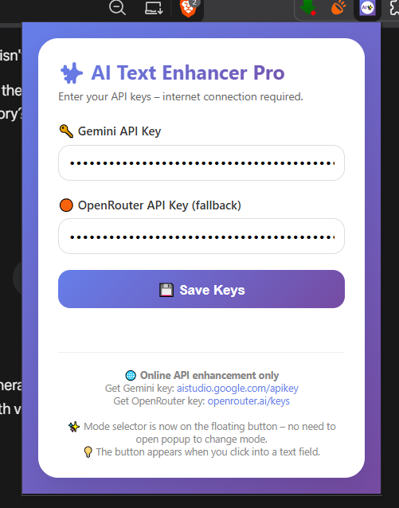
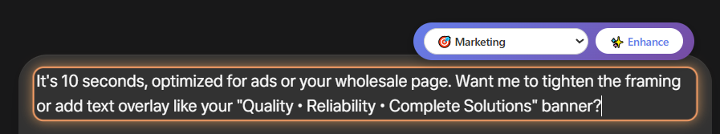
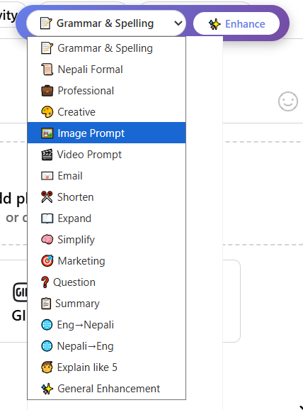
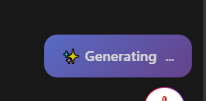

# AI Text Enhancer Pro

AI Text Enhancer Pro is a Chrome Manifest V3 extension that enhances, rewrites, translates, summarizes, and generates text directly inside editable fields on the web.

It adds a floating mode selector and **Enhance** button near the active text field, supports a keyboard shortcut, and uses **Gemini as the primary AI provider with OpenRouter as a fallback**.

## Highlights

- Works with standard inputs, textareas, `contenteditable` editors, React-based editors, and ProseMirror-style editors.
- Floating draggable toolbar with 17 AI text modes.
- Mode-specific animated loading borders around the active editor while a request is running.
- Separate compact `Generating...` status loader.
- Gemini primary provider with automatic OpenRouter fallback.
- `Ctrl + Shift + E` shortcut on Windows/Linux and `Command + Shift + E` on macOS.
- Right-click **Enhance with AI** context-menu action for selected text.
- API keys are entered through the extension popup and stored in Chrome extension storage instead of being hardcoded in the source.
- Manual compatibility testing has covered ChatGPT, Gmail, Facebook comments/posts, Messenger, Gemini, Meta AI, and NotebookLM.

## Text Modes

| Mode | Purpose |
| --- | --- |
| Grammar & Spelling | Correct grammar and spelling while preserving meaning |
| Nepali Formal | Rewrite text in formal Nepali using Devanagari |
| Professional | Rewrite in a polished business tone |
| Creative | Produce more vivid and expressive writing |
| Image Prompt | Expand an idea into a detailed AI image prompt |
| Video Prompt | Expand an idea into a detailed AI video prompt |
| Email | Turn input into a complete professional email |
| Shorten | Make text concise while retaining key information |
| Expand | Add useful detail, explanation, and context |
| Simplify | Rewrite using clearer and easier language |
| Marketing | Produce persuasive marketing copy |
| Question | Convert a statement into a natural question |
| Summary | Condense text into its key points |
| English → Nepali | Translate English into natural Nepali |
| Nepali → English | Translate Nepali into natural English |
| ELI5 | Explain a concept in very simple language |
| General Enhancement | Improve grammar, clarity, readability, and professionalism |

Each mode also maps to its own visual loading style, such as Flow, Aurora, Neon, Sweep, Travel, or Quantum.

## How It Works

1. Click or focus an editable text field on a supported webpage.
2. The extension displays a floating toolbar near the active editor.
3. Choose a mode.
4. Click **Enhance** or press the keyboard shortcut.
5. A mode-specific animated border appears around the active editor while the AI request is processed.
6. The generated result replaces the original text in the editor.
7. If the primary Gemini request fails and an OpenRouter key is available, the extension automatically attempts OpenRouter.

## Installation

This project is currently intended for local/unpacked Chrome installation.

1. Download or clone this repository.
2. Open Chrome and go to `chrome://extensions`.
3. Enable **Developer mode**.
4. Click **Load unpacked**.
5. Select the project folder containing `manifest.json`.
6. Pin **AI Text Enhancer Pro** from the Extensions menu if desired.

After changing source files during development, use **Reload** on the extension card and refresh any already-open test pages.

## API Setup

Open the extension popup and enter at least one provider key:

- **Gemini API key** — used as the primary provider.
- **OpenRouter API key** — used as the fallback provider when configured.

You may configure both providers or use only one.

API keys are stored using `chrome.storage.local`. They are not included in this repository. Chrome extension local storage should not be treated as a general-purpose encrypted secrets vault, so use keys intended for your own extension usage and manage provider limits appropriately.

## Keyboard Shortcut

Default shortcut:

- Windows/Linux: `Ctrl + Shift + E`
- macOS: `Command + Shift + E`

Chrome may leave a suggested shortcut unassigned if it conflicts with another browser, operating-system, or extension shortcut. Users can inspect shortcut assignments at `chrome://extensions/shortcuts`.

## Context Menu

Select text on a webpage and right-click to use:

**✨ Enhance with AI**

The currently selected enhancement mode is used for the request.

## Project Structure

```text
AI-Text-Enhancer-Pro/
├── icons/
│   ├── icon16.png
│   ├── icon32.png
│   ├── icon48.png
│   └── icon128.png
├── background.js
├── content.js
├── manifest.json
├── popup.html
├── popup.js
├── docs/
│   ├── floating-toolbar.png
│   ├── animated-border.png
│   ├── settings-popup.png
│   └── generating-loader.png
├── styles.css
├── README.md
├── LICENSE
└── .gitignore
```

### Main Files

- `background.js` — AI provider calls, fallback logic, context menu, shortcut handling, and stored settings synchronization.
- `content.js` — editable-field detection, floating toolbar, text replacement, dynamic-page support, and loading-border behavior.
- `styles.css` — generating loader, notifications, and mode-based field-border animations.
- `popup.html` / `popup.js` — API-key settings UI.
- `manifest.json` — Manifest V3 permissions, host permissions, content scripts, icons, and command configuration.

## Permissions

The extension currently requests:

| Permission | Why it is used |
| --- | --- |
| `activeTab` | Interact with the active page when needed |
| `storage` | Save API keys and the selected mode locally |
| `scripting` | Insert enhanced selected text for context-menu actions |
| `contextMenus` | Add the right-click enhancement action |

Host permissions are limited to the configured AI provider endpoints:

- `generativelanguage.googleapis.com`
- `openrouter.ai`

The content script is configured for web pages so that the toolbar can detect editable fields across supported sites.

## Privacy Notes

- The extension has no custom application backend in this repository.
- Text is sent to the configured AI provider only when the user triggers an enhancement action.
- API requests are made directly from the extension to the selected provider.
- API keys are stored locally in Chrome extension storage and are not hardcoded in the repository.
- Provider privacy policies and data-handling terms still apply to text sent to those services.

Do not commit real API keys, exported browser profiles, or other credentials to the repository.

## Compatibility

The editor-detection logic supports common web editing patterns including:

- `<input>` and `<textarea>`
- `contenteditable`
- React-controlled fields
- ProseMirror-style editors
- dynamically recreated editors in single-page applications
- editable content inside permitted frames

Websites can change their DOM and editor implementations over time. A site-specific adjustment may occasionally be required after a major redesign.

## Screenshots

### Floating Mode Selector

The floating toolbar appears next to the active editor and provides quick access to all 17 enhancement modes.



### Mode-Based Animated Border

While a request is running, the active editor receives a mode-specific visual loading border. The example below shows the **Marketing** mode.



### API Settings Popup

Users can configure Gemini as the primary provider and OpenRouter as the optional fallback from the extension popup.



A compact generating indicator is also displayed during requests:



## Development Checklist

Before tagging a release or publishing an update:

- Confirm Gemini requests work with a valid key.
- Confirm OpenRouter works directly.
- Confirm Gemini failure falls back to OpenRouter when both keys are configured.
- Test at least one normal input/textarea and one `contenteditable` editor.
- Test the keyboard shortcut.
- Confirm the animated border disappears after success and error states.
- Confirm no credentials are present in tracked files.

## Limitations

- Protected browser pages such as `chrome://` pages do not allow normal content-script injection.
- Provider availability, quotas, rate limits, and model availability are controlled by the external AI providers.
- Site compatibility may change when websites redesign their editors.
- The project currently requires users to provide their own API key(s).

## License

Released under the MIT License. See [`LICENSE`](LICENSE).
